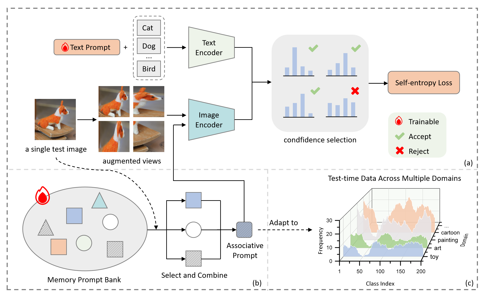

# 🍃MINT: Memory-Infused Prompt Tuning at Test-time for CLIP
This repository is official PyTorch implementation of our paper:    

> MINT: Memory-Infused Prompt Tuning at Test-time for CLIP   
> Authors: *Jiaming Yi, Ruirui Pan, Jishen Yang, Xiulong Yang*    

For more details, please check out our [**paper**](https://arxiv.org/abs/2506.03190).


## Prerequisites

### Hardware
This codebase is tested on a single NVIDIA A100 GPU. Other NVIDIA GPUs with sufficient memory (>= 16GB recommended) should also work.

### Environment 
We recommend using Conda to manage the Python environment. Follow these steps to create and activate the environment:
```bash
conda env create -f environment.yaml
conda activate MINT
```

### Datasets 
Please download the following datasets:
* [ImageNet-A](https://github.com/hendrycks/natural-adv-examples)
* [ImageNet-R](https://github.com/hendrycks/imagenet-r)
* [ImageNet-V2](https://s3-us-west-2.amazonaws.com/imagenetv2public/imagenetv2-matched-frequency.tar.gz)
* [ImageNet-Sketch](https://github.com/HaohanWang/ImageNet-Sketch)


We suggest placing all datasets under a common parent directory (e.g., `datasets/` within the project root). The expected directory structure is as follows:
```
MINT/                     # Project root
├── main.py
├── environment.yaml
├── datasets/             # Parent directory for datasets
│   ├── imagenet-a/
│   ├── imagenet-r/
│   ├── imagenetv2-matched-frequency/  
│   └── imagenet-sketch/
└── ... (other project files)
```

## Running MINT
You can run the MINT with the following commands:

```bash
# Run MINT on ImageNet-A using GPU 0
# Assumes datasets are in a 'datasets' folder in the project root
python main.py datasets --test_sets A --gpu 0

# Run MINT on all supported datasets
python main.py datasets --test_sets A/V/R/K --gpu 0
```

## Results
**Top-1 accuracy comparison results on various ImageNet benchmarks, compared against other leading methods.**

| Methods       | Publication | ImageNet-R       | ImageNet-A        | ImageNet-V2       | ImageNet-Sketch | Average         |
| :------------ | :---------: | :--------------: | :---------------: | :---------------: | :-------------: | :-------------: |
| CLIP          | ICML'21     | 73.98            | 47.87             | 60.86             | 46.09           | 57.20           |
| Ensemble      | ICML'21     | 77.65            | 49.89             | 61.88             | 48.24           | 59.42           |
| CoOp          | IJCV'22     | 75.21            | 49.71             | 64.20             | 47.99           | 59.28           |
| CoCoOp        | CVPR'22     | 76.18            | 50.63             | 64.07             | 48.75           | 59.91           |
| MaPLe         | CVPR'23     | 76.98            | 50.90             | 64.07             | <u>49.15</u>     | 60.28           |
| TPT           | NeurIPS'22  | 77.06            | 54.77             | 63.45             | 47.94           | 60.81           |
| SAR           | ICLR'23     | 75.81            | 48.89             | 63.29             | 47.59           | 58.90           |
| MTA           | CVPR'24     | <u>78.33</u>    | 58.06             | <u>64.24</u>     | **49.61**       | 62.56           |
| ZERO          | NeurIPS'24  | 77.28            | **61.35**         | 64.13             | 48.29           | <u>62.76</u>     |
| **MINT**      | **Ours**    | **78.68**        | <u>59.83</u>     | **65.83**         | 48.16           | **63.12**       |

## Acknowledgement
This work is built upon and extends the Test-Time Prompt Tuning (TPT) framework. We thank the TPT authors for their foundational work and publicly available [code](https://github.com/azshue/TPT).
